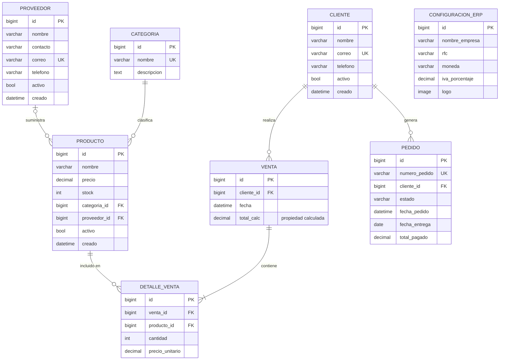

# Guía de Laboratorio — W04
## ERP Django · Espiral 2 · Semana 4 de 24
### Técnico en Programación (SEP 3061300006-23) · UTEC Celaya
### Asesor: MC. Román Fernando López González

---

| Campo | Detalle |
|---|---|
| **Semana** | W04 de 24 |
| **Espiral** | E2 — Modelado de Datos y ORM |
| **Sprint Scrum** | Sprint 1 — Planning |
| **Hito** | Sin hito propio · Prerrequisito obligatorio de M2 (W06) |
| **Horario** | 16:45 – 19:45 (180 min) |
| **Nivel Schmelkes** | 2 — Núcleo ERP |
| **Hilo conductor** | "Antes de construir el edificio, se aprueba el plano arquitectónico." |

> **⚠️ Semana de DISEÑO.** En W04 no se escribe código Django de modelos.
> El diagrama ER debe ser revisado y aprobado por el asesor antes de
> que W05 pueda comenzar. Un modelo mal diseñado ahora cuesta 10×
> corregirlo después de tener datos reales.

---

## Conexión con la Espiral 2

| Semana | Actividad | Dependencia |
|---|---|---|
| **W04** | Diseño ER + normalización + aprobación | Prerrequisito de W05 |
| **W05** | Implementar modelos Django + migraciones | Requiere ER aprobado de W04 |
| **W06** | Validadores + tests de modelo + admin Jazzmin · **M2** | Requiere modelos de W05 |

---

## Objetivos de la sesión

Al terminar W04, el estudiante será capaz de:

1. Redactar el Sprint 1 Planning con Sprint Goal y 8 HUs de modelado
2. Identificar las 8 entidades del ERP con sus atributos y tipos de dato
3. Definir relaciones `ForeignKey`, `ManyToMany` y `OneToOne` con cardinalidad
4. Aplicar las reglas de la Tercera Forma Normal (3FN) al esquema
5. Crear el diagrama ER en formato Mermaid (visible en GitHub)
6. Documentar decisiones de diseño con justificación técnica
7. Presentar el diagrama al asesor y obtener aprobación formal

---

## Stack tecnológico de W04

| Herramienta | Rol en W04 | Instalación |
|---|---|---|
| Mermaid (Markdown) | Diagramas ER versionados en GitHub | Nativo en GitHub |
| dbdiagram.io | Diseño visual del ER (navegador) | Sin instalación |
| VS Code + extensión Mermaid | Vista previa del diagrama en local | Extensión: "Mermaid Preview" |
| Papel / pizarrón | Borrador inicial antes de digitalizar | Sin instalación |

> No se instalan nuevas dependencias Python en W04.

---

## Mapa de tiempo (180 min)

| Parte | Actividad | Tiempo |
|---|---|---|
| Arranque | Daily Scrum + verificar M1 + abrir Sprint 1 | 10 min |
| Parte 1 | Sprint 1 Planning: Sprint Goal + HUs | 20 min |
| Parte 2 | Identificar entidades y atributos (tabla) | 30 min |
| Parte 3 | Diseñar relaciones y normalizar a 3FN | 35 min |
| Parte 4 | Diagrama ER en Mermaid + dbdiagram.io | 35 min |
| Parte 5 | Decisiones de diseño + apertura ficha E2 | 20 min |
| Parte 6 | Tests W04 + commit + respaldo | 15 min |
| Cierre | Presentación al asesor · checklist · hilo → W05 | 15 min |
| **Total** | | **180 min** |

---

## ARRANQUE — Daily Scrum + Sprint 1 kick-off (10 min)

```cmd
E:\iniciar_sesion.bat
```

### Daily Scrum

```
1. ¿Qué hice en W03?
   → Completé settings_prod.py, desplegué en Render.com
     y cerré el Sprint 0 con Review y Retrospectiva.

2. ¿Qué haré en W04?
   → Diseñaré el modelo ER completo del ERP, lo normalizaré
     a 3FN y obtendré la aprobación del asesor.

3. ¿Tengo algún impedimento?
   → (registrar aquí cualquier problema pendiente)
```

### Verificar estado de la base (5 min)

```cmd
python manage.py check
python manage.py test tests --verbosity=0
git log --oneline -3
```

**Resultado esperado:**
```
System check identified no issues (0 silenced).
....................................... (33 tests OK)
abc1234 Sprint 0 CIERRE [M1]: Render.com desplegado + 33 tests OK
```

### Crear estructura de documentación

```cmd
mkdir docs
mkdir docs\diagramas
mkdir evidencias\espiral_02
```

---

## PARTE 1 — Sprint 1 Planning (20 min)

### 1.1 Evento Scrum: Sprint Planning

**Sprint Goal del Sprint 1:**
> *"Al finalizar el Sprint 1, el ERP tendrá un esquema de base de datos
> completo implementado en Django, con 8 entidades, relaciones verificadas,
> panel admin funcional y una suite de ≥ 15 pruebas de modelo pasando."*

**Duración del Sprint 1:** W04 – W06 (3 semanas)

---

### 1.2 Crear `sprint1_planning.md`

```markdown
# Sprint 1 Planning — ERP Django
## Semanas W04–W06 · Espiral 2: Modelado de Datos y ORM

**Sprint Goal:**
Al finalizar el Sprint 1, el ERP tendrá un esquema de base de datos
completo implementado en Django, con 8 entidades, relaciones verificadas,
panel admin funcional y una suite de ≥ 15 pruebas de modelo pasando.

**Duración:** W04 (diseño) · W05 (implementación) · W06 (validación + M2)

---

## HUs seleccionadas del Product Backlog

| ID | Historia de Usuario | Puntos | Semana |
|---|---|---|---|
| HU-E2-01 | Como dev, quiero un diagrama ER aprobado para tener el plano del ERP | 3 | W04 |
| HU-E2-02 | Como admin, quiero registrar clientes con nombre, correo y teléfono | 2 | W05 |
| HU-E2-03 | Como admin, quiero registrar proveedores con contacto y correo | 2 | W05 |
| HU-E2-04 | Como admin, quiero registrar categorías para clasificar productos | 1 | W05 |
| HU-E2-05 | Como admin, quiero registrar productos con precio, stock y categoría | 3 | W05 |
| HU-E2-06 | Como admin, quiero registrar ventas con líneas de detalle y total | 5 | W05 |
| HU-E2-07 | Como dev, quiero 15+ tests de modelo para garantizar la integridad | 3 | W06 |
| HU-E2-08 | Como admin, quiero ver todos los modelos en el panel admin con Jazzmin | 2 | W06 |

**Total de puntos del Sprint 1:** 21 puntos

---

## Sprint Backlog — Tareas técnicas

| Tarea | Semana | Estado |
|---|---|---|
| Diseñar diagrama ER (8 entidades) | W04 | ⏳ |
| Normalizar a 3FN y documentar decisiones | W04 | ⏳ |
| Obtener aprobación del asesor | W04 | ⏳ |
| Implementar models.py × 5 apps | W05 | ⏳ |
| Ejecutar makemigrations + migrate | W05 | ⏳ |
| Registrar modelos en admin.py | W05 | ⏳ |
| Agregar validators a campos críticos | W06 | ⏳ |
| Escribir tests/test_models.py (≥ 15 tests) | W06 | ⏳ |
| Instalar y configurar django-jazzmin | W06 | ⏳ |

---

## Definición de Terminado (DoD) — Sprint 1

- Diagrama ER aprobado formalmente por el asesor (firma en ficha)
- `python manage.py showmigrations` → `[X] 0001_initial` en cada app
- `/admin/` muestra las 8 entidades correctamente
- `python manage.py test tests.test_models` → ≥ 15 tests PASSED
- Precio negativo en Producto → `ValidationError`
- Correo duplicado en Cliente → `IntegrityError`
- `fichas/espiral_02_modelos.md` completa
```

---

## PARTE 2 — Identificar Entidades y Atributos (30 min)

### 2.1 Respuesta a la tarea de investigación de W03

> **¿Qué es la Tercera Forma Normal (3FN)?**
>
> Una tabla está en 3FN cuando:
> 1. Está en 2FN (cada atributo no clave depende de **toda** la clave primaria)
> 2. No existen dependencias transitivas (ningún atributo no clave depende
>    de otro atributo no clave)
>
> **Ejemplo de violación 3FN en un ERP:**
> ```
> Tabla PRODUCTO: id, nombre, precio, categoria_id, categoria_nombre
>                                                    ↑
>                              categoria_nombre depende de categoria_id,
>                              no de id → viola 3FN
> ```
>
> **Solución:** extraer `categoria_nombre` a la tabla `CATEGORIA`
> y referenciarla con `ForeignKey`.

---

### 2.2 Las 8 entidades del ERP

Registrar en papel o en la libreta. Luego transcribir a `docs/entidades_atributos.md`.

#### Entidad 1 — `Categoria`

| Atributo | Tipo Django | Restricción | Justificación |
|---|---|---|---|
| `id` | `BigAutoField` | PK, auto | Clave primaria generada |
| `nombre` | `CharField(100)` | unique, not null | Sin categorías duplicadas |
| `descripcion` | `TextField` | blank=True | Opcional — puede estar vacía |

#### Entidad 2 — `Proveedor`

| Atributo | Tipo Django | Restricción | Justificación |
|---|---|---|---|
| `id` | `BigAutoField` | PK, auto | Clave primaria generada |
| `nombre` | `CharField(150)` | not null | Nombre comercial del proveedor |
| `contacto` | `CharField(100)` | blank=True | Persona de contacto (opcional) |
| `correo` | `EmailField` | unique, not null | Identificador único de contacto |
| `telefono` | `CharField(20)` | blank=True | Formato libre por región |
| `activo` | `BooleanField` | default=True | Soft-delete: desactivar sin borrar |
| `creado` | `DateTimeField` | auto_now_add | Trazabilidad automática |

#### Entidad 3 — `Cliente`

| Atributo | Tipo Django | Restricción | Justificación |
|---|---|---|---|
| `id` | `BigAutoField` | PK, auto | Clave primaria generada |
| `nombre` | `CharField(150)` | not null | Nombre completo o razón social |
| `correo` | `EmailField` | unique, not null | Login y contacto principal |
| `telefono` | `CharField(20)` | blank=True | Opcional — no todos lo tienen |
| `activo` | `BooleanField` | default=True | Soft-delete |
| `creado` | `DateTimeField` | auto_now_add | Trazabilidad |

#### Entidad 4 — `Producto`

| Atributo | Tipo Django | Restricción | Justificación |
|---|---|---|---|
| `id` | `BigAutoField` | PK, auto | |
| `nombre` | `CharField(200)` | not null | Nombre del artículo |
| `precio` | `DecimalField(10,2)` | MinValueValidator(0) | Precio ≥ 0 siempre |
| `stock` | `IntegerField` | default=0, MinValue(0) | Stock no puede ser negativo |
| `categoria` | `ForeignKey(Categoria)` | PROTECT | Ver decisión D-01 |
| `proveedor` | `ForeignKey(Proveedor)` | SET_NULL, null=True | Ver decisión D-02 |
| `activo` | `BooleanField` | default=True | Soft-delete |
| `creado` | `DateTimeField` | auto_now_add | Trazabilidad |

#### Entidad 5 — `Venta`

| Atributo | Tipo Django | Restricción | Justificación |
|---|---|---|---|
| `id` | `BigAutoField` | PK, auto | |
| `cliente` | `ForeignKey(Cliente)` | PROTECT | Ver decisión D-03 |
| `fecha` | `DateTimeField` | auto_now_add | Fecha de creación inmutable |
| `total` | **Propiedad calculada** | NO es campo de BD | Ver decisión D-04 |

#### Entidad 6 — `DetalleVenta`

| Atributo | Tipo Django | Restricción | Justificación |
|---|---|---|---|
| `id` | `BigAutoField` | PK, auto | |
| `venta` | `ForeignKey(Venta)` | CASCADE | Si se borra Venta → borra detalles |
| `producto` | `ForeignKey(Producto)` | PROTECT | Ver decisión D-05 |
| `cantidad` | `PositiveIntegerField` | ≥ 1 | No puede haber 0 unidades |
| `precio_unitario` | `DecimalField(10,2)` | not null | Ver decisión D-06 |

#### Entidad 7 — `Pedido` (e-commerce, implementado en Espiral 5)

| Atributo | Tipo Django | Restricción | Justificación |
|---|---|---|---|
| `id` | `BigAutoField` | PK, auto | |
| `numero_pedido` | `CharField(20)` | unique | Código legible: `PED-2025-0001` |
| `cliente` | `ForeignKey(Cliente)` | PROTECT | Pedido siempre tiene cliente |
| `estado` | `CharField(20)` | choices | pendiente/pagado/enviado/cancelado |
| `fecha_pedido` | `DateTimeField` | auto_now_add | Cuándo se creó |
| `fecha_entrega` | `DateField` | null=True | Cuándo se entregó (opcional) |
| `total_pagado` | `DecimalField(10,2)` | null=True | Registrado al procesar pago |

#### Entidad 8 — `ConfiguracionERP` (singleton del sistema)

| Atributo | Tipo Django | Restricción | Justificación |
|---|---|---|---|
| `id` | `BigAutoField` | PK, auto | |
| `nombre_empresa` | `CharField(200)` | not null | Aparece en facturas y PDF |
| `rfc` | `CharField(13)` | blank=True | RFC del negocio (México) |
| `moneda` | `CharField(3)` | default='MXN' | ISO 4217 |
| `iva_porcentaje` | `DecimalField(5,2)` | default=16.00 | IVA México estándar |
| `logo` | `ImageField` | null=True, blank=True | Logo para facturas PDF |

---

### 2.3 Crear `docs/entidades_atributos.md`

Copiar la tabla anterior completa en el archivo
`docs/entidades_atributos.md` como referencia durante W05.

---

## PARTE 3 — Relaciones y Normalización 3FN (35 min)

### 3.1 Mapa de relaciones

```
CATEGORIA (1) ──────────────── (N) PRODUCTO
PROVEEDOR (1) ──────────────── (N) PRODUCTO  (nullable)
CLIENTE   (1) ──────────────── (N) VENTA
CLIENTE   (1) ──────────────── (N) PEDIDO
VENTA     (1) ──────────────── (N) DETALLE_VENTA
PRODUCTO  (1) ──────────────── (N) DETALLE_VENTA

Cardinalidades:
  1:N  → ForeignKey en el lado N
  N:M  → No aplica en este esquema inicial
  1:1  → ConfiguracionERP (singleton: solo 1 fila)
```

### 3.2 Estrategias `on_delete` justificadas

| Relación | Estrategia | Justificación |
|---|---|---|
| `Producto → Categoria` | `PROTECT` | No borrar categoría si tiene productos activos |
| `Producto → Proveedor` | `SET_NULL` | El producto puede existir sin proveedor asignado |
| `Venta → Cliente` | `PROTECT` | No borrar cliente con historial de ventas |
| `DetalleVenta → Venta` | `CASCADE` | Líneas de detalle no tienen sentido sin su venta |
| `DetalleVenta → Producto` | `PROTECT` | No borrar producto que tuvo ventas históricas |
| `Pedido → Cliente` | `PROTECT` | No borrar cliente con pedidos registrados |

---

### 3.3 Verificación de 3FN — cada entidad

**CATEGORIA** ✅ 3FN
- `descripcion` depende directamente de `id` (no hay dependencia transitiva)

**PRODUCTO** ✅ 3FN
- `nombre`, `precio`, `stock` dependen de `id`
- `categoria_id` es FK (no almacenamos `categoria_nombre` → evita violación 3FN)
- `proveedor_id` es FK (no almacenamos `proveedor_nombre`)

**DETALLE_VENTA** — Denormalización intencional (ver D-06):
- `precio_unitario` podría derivarse de `Producto.precio`
- **Pero:** el precio puede cambiar después de la venta; necesitamos el precio
  **al momento de la venta** → almacenar es correcto y necesario

**VENTA** ✅ 3FN
- `total` NO se almacena (es propiedad calculada: `sum(detalle.subtotal)`)
- Almacenarlo crearía dependencia transitiva: `total` depende de `DetalleVenta`,
  no directamente de `Venta.id`

---

### 3.4 Decisiones de diseño críticas

Crear `docs/decisiones_diseno.md`:

```markdown
# Decisiones de Diseño — ERP Django
## Espiral 2 · Modelo Entidad-Relación

---

### D-01: Producto → Categoria usa on_delete=PROTECT

**Decisión:** No permitir borrar una categoría si tiene productos asociados.

**Alternativas consideradas:**
- `CASCADE`: borraría todos los productos de esa categoría (peligroso)
- `SET_NULL`: dejaría productos sin categoría (viola integridad de negocio)

**Consecuencia:** Para borrar una categoría, primero reasignar sus productos.
Esto es correcto: un ERP no debe perder histórico de productos.

---

### D-02: Producto → Proveedor usa on_delete=SET_NULL, null=True

**Decisión:** Un producto puede existir sin proveedor asignado.

**Justificación:** Productos fabricados internamente o de proveedor desconocido.
Al borrar un proveedor, los productos no desaparecen; quedan sin proveedor.

---

### D-03: Venta → Cliente usa on_delete=PROTECT

**Decisión:** No borrar un cliente con historial de ventas.

**Justificación legal:** El historial de ventas es un registro contable.
Borrar el cliente implicaría borrar evidencia fiscal.
Usar `activo=False` para "dar de baja" sin borrar datos.

---

### D-04: Venta.total es propiedad calculada (NO campo de BD)

**Decisión:** `total` se calcula en tiempo de ejecución, no se almacena.

```python
@property
def total(self):
    return sum(d.subtotal for d in self.detalles.all())
```

**Justificación:** Almacenar `total` crearía dependencia transitiva
(viola 3FN: `total` depende de `DetalleVenta`, no de `Venta.id`).
Además, si se modifica una línea, el total calculado siempre es correcto.

**Advertencia de rendimiento:** Para dashboards con miles de ventas,
usar `annotate(total=Sum(...))` en lugar de la property.

---

### D-05: DetalleVenta → Producto usa on_delete=PROTECT

**Decisión:** No borrar un producto que tuvo ventas históricas.

**Justificación:** Los reportes de ventas históricas referencian productos.
Usar `activo=False` en Producto para "descontinuar" sin borrar.

---

### D-06: DetalleVenta.precio_unitario es campo almacenado

**Decisión:** Almacenar el precio al momento de la venta, no derivarlo
de `Producto.precio`.

**Justificación:** El precio de un producto puede cambiar después de
la venta. El histórico de ventas debe reflejar el precio real cobrado,
no el precio actual del producto.

**Implementación:** El `save()` del modelo captura el precio si no
se especifica:
```python
def save(self, *args, **kwargs):
    if not self.precio_unitario:
        self.precio_unitario = self.producto.precio
    super().save(*args, **kwargs)
```

---

### D-07: ConfiguracionERP como singleton

**Decisión:** Una sola fila de configuración global del sistema.

**Implementación:** Sobrescribir `save()` para que siempre use `pk=1`,
y en el admin, deshabilitar el botón "Agregar".

**Alternativa:** `django-constance` (configuración dinámica). Se evaluará
en la Espiral 7 cuando se implemente el dashboard.
```

---

## PARTE 4 — Diagrama ER en Mermaid y dbdiagram.io (35 min)

### 4.1 Crear `docs/diagramas/diagrama_er.md`

Este archivo es visible directamente en GitHub con el diagrama renderizado:

````markdown
# Diagrama Entidad-Relación — ERP Django
## Espiral 2 · Aprobado por: MC. Román Fernando López González
## Fecha de aprobación: ___/___/_____



## Cardinalidades

| Relación | Tipo | Descripción |
|---|---|---|
| Categoria → Producto | 1:N obligatorio | Un producto siempre tiene categoría |
| Proveedor → Producto | 1:N opcional | Un producto puede no tener proveedor |
| Cliente → Venta | 1:N | Una venta siempre tiene cliente |
| Cliente → Pedido | 1:N | Un pedido siempre tiene cliente |
| Venta → DetalleVenta | 1:N obligatorio | Una venta tiene al menos 1 línea |
| Producto → DetalleVenta | 1:N | Un producto puede aparecer en N ventas |

## Notas de diseño

- `Venta.total` es una **propiedad calculada**, no un campo de BD (decisión D-04)
- `DetalleVenta.precio_unitario` se almacena por integridad histórica (D-06)
- `ConfiguracionERP` es un **singleton** (siempre pk=1) (D-07)
- `Pedido` se implementa en la **Espiral 5 (W13-W15)**

## Firma de aprobación

| Rol | Nombre | Fecha | Observaciones |
|---|---|---|---|
| Desarrollador | [Nombre] | | |
| Asesor (PO) | MC. Román Fernando López González | | |
````

---

### 4.2 Diagrama en dbdiagram.io (visualización alternativa)

Ir a `https://dbdiagram.io` y pegar este código en el editor:

```
// ERP Django — Diagrama ER
// dbdiagram.io syntax

Table Categoria {
  id bigint [pk, increment]
  nombre varchar(100) [not null, unique]
  descripcion text
}

Table Proveedor {
  id bigint [pk, increment]
  nombre varchar(150) [not null]
  contacto varchar(100)
  correo varchar(254) [not null, unique]
  telefono varchar(20)
  activo bool [default: true]
  creado datetime [default: `now()`]
}

Table Cliente {
  id bigint [pk, increment]
  nombre varchar(150) [not null]
  correo varchar(254) [not null, unique]
  telefono varchar(20)
  activo bool [default: true]
  creado datetime [default: `now()`]
}

Table Producto {
  id bigint [pk, increment]
  nombre varchar(200) [not null]
  precio decimal(10,2) [not null, note: 'MinValue: 0']
  stock int [default: 0, note: 'MinValue: 0']
  categoria_id bigint [ref: > Categoria.id, not null]
  proveedor_id bigint [ref: > Proveedor.id, null]
  activo bool [default: true]
  creado datetime [default: `now()`]
}

Table Venta {
  id bigint [pk, increment]
  cliente_id bigint [ref: > Cliente.id, not null]
  fecha datetime [default: `now()`]
  // total: propiedad calculada — NO es campo de BD
}

Table DetalleVenta {
  id bigint [pk, increment]
  venta_id bigint [ref: > Venta.id, not null]
  producto_id bigint [ref: > Producto.id, not null]
  cantidad int [not null, note: 'PositiveInteger, >= 1']
  precio_unitario decimal(10,2) [not null, note: 'Precio al momento de la venta']
}

Table Pedido {
  id bigint [pk, increment]
  numero_pedido varchar(20) [unique, note: 'PED-YYYY-NNNN']
  cliente_id bigint [ref: > Cliente.id, not null]
  estado varchar(20) [note: 'pendiente|pagado|enviado|cancelado']
  fecha_pedido datetime [default: `now()`]
  fecha_entrega date [null]
  total_pagado decimal(10,2) [null]
}

Table ConfiguracionERP {
  id bigint [pk, note: 'Siempre pk=1 (singleton)']
  nombre_empresa varchar(200) [not null]
  rfc varchar(13)
  moneda varchar(3) [default: 'MXN']
  iva_porcentaje decimal(5,2) [default: 16.00]
  logo varchar [null, note: 'ImageField — ruta al archivo']
}
```

**Exportar como imagen:** dbdiagram.io → Export → PNG → guardar en
`evidencias/espiral_02/diagrama_er.png`

---

### 4.3 Verificación visual del diagrama

```
[ ] El diagrama muestra exactamente 8 entidades
[ ] Todas las FK tienen su flecha de relación visible
[ ] Cardinalidades 1:N y 1:1 claramente indicadas
[ ] No hay atributos derivados almacenados (Venta.total no aparece como campo)
[ ] Captura guardada en evidencias/espiral_02/diagrama_er.png
```

---

## PARTE 5 — Ficha Schmelkes E2 (apertura) (20 min)

### 5.1 Crear `fichas/espiral_02_modelos.md`

```markdown
# Ficha de Sistematización — Espiral 2
## ERP Django · Espiral E2: Modelado de Datos y ORM
## UTEC Celaya · Técnico en Programación (SEP 3061300006-23)

| Campo | Contenido |
|---|---|
| **Número de espiral** | 2 |
| **Nombre del ciclo** | Modelado de Datos y ORM |
| **Semanas** | W04 – W06 |
| **Fecha de inicio** | ___/___/_____ |
| **Fecha de cierre** | (completar en W06) |
| **Responsable** | [Nombre del estudiante] |
| **Asesor** | MC. Román Fernando López González |

---

## 1. Objetivo del ciclo

Diseñar, implementar y validar el esquema de base de datos completo del
ERP en Django, garantizando integridad referencial, normalización 3FN y
cobertura de pruebas ≥ 15 tests de modelo.

---

## 2. Tareas realizadas

| # | Tarea | Estado | Tiempo invertido |
|---|---|---|---|
| 1 | Diseño diagrama ER (8 entidades) | ✅ W04 | h:mm |
| 2 | Normalización 3FN y decisiones de diseño | ✅ W04 | h:mm |
| 3 | Aprobación del asesor | ⏳ W04 | — |
| 4 | Implementar models.py × 5 apps | ⏳ W05 | — |
| 5 | Ejecutar makemigrations + migrate | ⏳ W05 | — |
| 6 | Registrar en admin.py | ⏳ W05 | — |
| 7 | Agregar validators | ⏳ W06 | — |
| 8 | Suite de ≥ 15 tests de modelo | ⏳ W06 | — |
| 9 | Instalar django-jazzmin | ⏳ W06 | — |

---

## 3. Evidencias generadas (completar durante W04–W06)

- [ ] Diagrama ER aprobado: `docs/diagramas/diagrama_er.md`
- [ ] Imagen exportada: `evidencias/espiral_02/diagrama_er.png`
- [ ] Decisiones de diseño: `docs/decisiones_diseno.md`
- [ ] Tabla de entidades: `docs/entidades_atributos.md`
- [ ] Migraciones: `*/migrations/0001_initial.py` × 5 apps
- [ ] Tests: `tests/test_models.py` — resultado: ___/15 OK

---

## 4. Criterios de aceptación (se verifican en W06)

| Criterio | Estado | Evidencia |
|---|---|---|
| Diagrama ER aprobado por el asesor | ⏳ | Firma en ficha |
| `showmigrations` → `[X] 0001_initial` en 5 apps | ⏳ | Terminal |
| `/admin/` muestra las 8 entidades | ⏳ | Captura |
| ≥ 15 tests de modelo PASSED | ⏳ | pytest output |
| Precio negativo → ValidationError | ⏳ | Test específico |
| Correo duplicado → IntegrityError | ⏳ | Test específico |

---

## 5. Problemas encontrados y soluciones
(completar durante W04–W06)

---

## 6. Lecciones aprendidas
(completar al cerrar en W06)

1.
2.
3.

---

## 7. Tiempo total invertido
(completar al cerrar en W06)

| Categoría | Horas |
|---|---|
| Diseño / planeación | |
| Implementación | |
| Pruebas | |
| Documentación | |
| **Total Espiral 2** | |

---

## 8. Aprobación formal del diagrama ER

| Rol | Nombre | Fecha | Observaciones |
|---|---|---|---|
| Desarrollador | [Nombre] | | |
| **Asesor (PO)** | **MC. Román Fernando López González** | | |

> ⚠️ **La Espiral 2 (W05) no puede iniciar sin la aprobación registrada aquí.**
```

---

## PARTE 6 — Tests W04 y Commit (15 min)

### 6.1 Crear `tests/test_w04_diseno.py`

```python
"""Suite de pruebas W04 — Artefactos de diseño del modelo ER.

Verifica que los documentos de diseño existen y tienen contenido mínimo.
No se prueban modelos Django (aún no existen — eso es W05).

Ejecutar con:
    python manage.py test tests.test_w04_diseno --verbosity=2

Resultado esperado:
    Ran 8 tests in X.XXXs
    OK
"""
from pathlib import Path

from django.conf import settings
from django.test import TestCase

BASE_DIR = Path(settings.BASE_DIR)


class DocumentosDisenioTest(TestCase):
    """Verifica existencia de artefactos de diseño del ER."""

    def test_docs_diagrama_er_existe(self):
        """El diagrama ER en Mermaid debe existir."""
        self.assertTrue(
            (BASE_DIR / 'docs' / 'diagramas' / 'diagrama_er.md').exists(),
            "docs/diagramas/diagrama_er.md no encontrado"
        )

    def test_diagrama_er_contiene_mermaid(self):
        """El diagrama ER debe contener bloques Mermaid."""
        path = BASE_DIR / 'docs' / 'diagramas' / 'diagrama_er.md'
        if path.exists():
            content = path.read_text(encoding='utf-8')
            self.assertIn('mermaid', content.lower(),
                          "diagrama_er.md no contiene bloque Mermaid")

    def test_diagrama_er_contiene_entidades_clave(self):
        """El diagrama debe mencionar las 8 entidades del ERP."""
        path = BASE_DIR / 'docs' / 'diagramas' / 'diagrama_er.md'
        if path.exists():
            content = path.read_text(encoding='utf-8').upper()
            for entidad in ['CLIENTE', 'PRODUCTO', 'VENTA', 'PROVEEDOR',
                            'CATEGORIA', 'DETALLE_VENTA']:
                self.assertIn(
                    entidad, content,
                    f"Entidad '{entidad}' no encontrada en el diagrama ER"
                )

    def test_entidades_atributos_existe(self):
        """El documento de entidades y atributos debe existir."""
        self.assertTrue(
            (BASE_DIR / 'docs' / 'entidades_atributos.md').exists(),
            "docs/entidades_atributos.md no encontrado"
        )

    def test_decisiones_diseno_existe(self):
        """El documento de decisiones de diseño debe existir."""
        self.assertTrue(
            (BASE_DIR / 'docs' / 'decisiones_diseno.md').exists(),
            "docs/decisiones_diseno.md no encontrado"
        )

    def test_decisiones_diseno_tiene_contenido(self):
        """El documento de decisiones debe tener al menos 5 decisiones."""
        path = BASE_DIR / 'docs' / 'decisiones_diseno.md'
        if path.exists():
            content = path.read_text(encoding='utf-8')
            # Contamos encabezados de decisión (### D-0N)
            decisiones = [l for l in content.splitlines()
                          if l.startswith('### D-')]
            self.assertGreaterEqual(
                len(decisiones), 5,
                f"Se esperaban ≥ 5 decisiones documentadas, "
                f"se encontraron {len(decisiones)}"
            )

    def test_sprint1_planning_existe(self):
        """El Sprint 1 Planning debe existir."""
        self.assertTrue(
            (BASE_DIR / 'sprint1_planning.md').exists(),
            "sprint1_planning.md no encontrado"
        )

    def test_sprint1_planning_tiene_sprint_goal(self):
        """El Sprint 1 Planning debe contener el Sprint Goal."""
        path = BASE_DIR / 'sprint1_planning.md'
        if path.exists():
            content = path.read_text(encoding='utf-8')
            self.assertIn(
                'Sprint Goal', content,
                "sprint1_planning.md debe contener 'Sprint Goal'"
            )
```

---

### 6.2 Ejecutar los tests

```cmd
python manage.py test tests.test_w04_diseno --verbosity=2
```

**Resultado esperado:**
```
test_decisiones_diseno_existe ... ok
test_decisiones_diseno_tiene_contenido ... ok
test_diagrama_er_contiene_entidades_clave ... ok
test_diagrama_er_contiene_mermaid ... ok
test_docs_diagrama_er_existe ... ok
test_entidades_atributos_existe ... ok
test_sprint1_planning_existe ... ok
test_sprint1_planning_tiene_sprint_goal ... ok

Ran 8 tests in X.XXXs
OK
```

### 6.3 Suite acumulada

```cmd
python manage.py test tests --verbosity=0
```

**Resultado esperado:** `Ran 41 tests in X.XXXs · OK` (33 + 8)

---

### 6.4 Commit W04

```cmd
git add .
git status

:: Debe incluir:
::   docs/diagramas/diagrama_er.md
::   docs/entidades_atributos.md
::   docs/decisiones_diseno.md
::   sprint1_planning.md
::   fichas/espiral_02_modelos.md
::   evidencias/espiral_02/diagrama_er.png
::   tests/test_w04_diseno.py

git commit -m "Sprint 1 W04: diagrama ER + decisiones diseno + 41 tests OK"
git push origin main
```

---

### 6.5 Ejecutar `finalizar_sesion.bat`

```cmd
E:\finalizar_sesion.bat
```

Verificar en `E:\WorkSpace_ERP\`:

```
[ ] docs/diagramas/diagrama_er.md
[ ] docs/entidades_atributos.md
[ ] docs/decisiones_diseno.md
[ ] sprint1_planning.md
[ ] fichas/espiral_02_modelos.md
[ ] evidencias/espiral_02/diagrama_er.png
[ ] tests/test_w04_diseno.py
```

---

## CIERRE — Presentación al Asesor y Checklist (15 min)

### Presentación del diagrama al asesor (≤ 10 min)

**Guión de presentación:**

```
1. Mostrar diagrama en GitHub (docs/diagramas/diagrama_er.md)
   → "Tenemos 8 entidades. La relación central es
      Venta → DetalleVenta → Producto."

2. Explicar la decisión más importante (D-04):
   → "Venta.total no se almacena en la BD porque
      depende de DetalleVenta, lo que violaría 3FN.
      Se calcula como propiedad en tiempo de ejecución."

3. Explicar la denormalización intencional (D-06):
   → "DetalleVenta.precio_unitario SÍ se almacena porque
      el precio del producto puede cambiar después de la venta.
      Necesitamos el precio histórico exacto."

4. Solicitar aprobación formal:
   → "¿Aprueba el asesor este esquema para comenzar
      la implementación en W05?"
```

### Firma de aprobación en la ficha

Al obtener aprobación, registrar en `fichas/espiral_02_modelos.md`:

```markdown
## 8. Aprobación formal del diagrama ER

| Rol | Nombre | Fecha | Observaciones |
|---|---|---|---|
| Desarrollador | [Nombre] | ___/___/_____ | |
| **Asesor (PO)** | **MC. Román Fernando López González** | ___/___/_____ | Aprobado ✅ |
```

> **Sin esta aprobación, W05 no puede iniciar.**
> Este es el único punto de control obligatorio entre W04 y W05.

---

## CHECKLIST FINAL W04

### Diseño

```
DIAGRAMA ER
[ ] docs/diagramas/diagrama_er.md con bloque Mermaid completo
[ ] Exactamente 8 entidades en el diagrama
[ ] Todas las FK tienen flecha de relación visible
[ ] Cardinalidades 1:N y 1:1 indicadas correctamente
[ ] Captura PNG en evidencias/espiral_02/diagrama_er.png

DOCUMENTACIÓN
[ ] docs/entidades_atributos.md: tabla completa (8 entidades × atributos)
[ ] docs/decisiones_diseno.md: ≥ 5 decisiones documentadas (D-01 a D-07)
[ ] Venta.total documentado como propiedad calculada (no campo)
[ ] DetalleVenta.precio_unitario justificado como denormalización intencional
[ ] on_delete de cada FK justificado

SCRUM
[ ] sprint1_planning.md: Sprint Goal + 8 HUs + Sprint Backlog
[ ] product_backlog.md: HUs E2-01 a E2-08 visibles con puntos
[ ] fichas/espiral_02_modelos.md: abierta con campos de W04 completados

APROBACIÓN (punto de control obligatorio)
[ ] Diagrama presentado al asesor
[ ] Observaciones del asesor registradas
[ ] Firma de aprobación en fichas/espiral_02_modelos.md

TESTS Y GIT
[ ] test tests.test_w04_diseno → 8/8 OK
[ ] test tests → 41/41 OK acumulados
[ ] Commit con mensaje descriptivo
[ ] git push → GitHub actualizado con docs/ y fichas/
[ ] finalizar_sesion.bat → archivos en USB
```

---

## DIAGRAMA: Flujo de aprobación W04 → W05

```
W04: Diseño
┌─────────────────────────────────────┐
│ 1. Identificar 8 entidades          │
│ 2. Definir atributos y tipos        │
│ 3. Mapear relaciones + cardinalidad │
│ 4. Verificar 3FN                    │
│ 5. Crear diagrama Mermaid           │
│ 6. Documentar 7 decisiones          │
└─────────────────────────────────────┘
              │
              ▼
    ┌──────────────────┐
    │ Revisión asesor  │
    │ ¿Aprobado?       │
    └──────────────────┘
         │         │
        SÍ         NO
         │         │
         │    ┌────▼──────────────────┐
         │    │ Correcciones del      │
         │    │ diagrama              │
         │    │ → Volver a revisar    │
         │    └───────────────────────┘
         │
         ▼
W05: Implementación (models.py)
┌─────────────────────────────────────┐
│ → models.py por cada app            │
│ → makemigrations + migrate          │
│ → admin.py con @admin.register      │
└─────────────────────────────────────┘
```

---

## HILO CONDUCTOR → W05

**¿Qué entrega W04?**
El plano arquitectónico del ERP: 8 entidades diseñadas,
normalizadas a 3FN, con relaciones justificadas y aprobadas
formalmente por el asesor.

**¿Qué necesita W05 de W04?**

| Artefacto de W04 | Uso en W05 |
|---|---|
| `docs/diagramas/diagrama_er.md` | Referencia para escribir cada `models.py` |
| `docs/entidades_atributos.md` | Define qué campos y tipos usar en cada modelo |
| `docs/decisiones_diseno.md` | Define `on_delete`, `null`, `blank` por relación |
| Firma de aprobación del asesor | Autoriza el inicio de W05 |

**Tarea de investigación para W05:**
> Lee la documentación de Django sobre `ForeignKey`:
> `https://docs.djangoproject.com/en/4.2/ref/models/fields/#foreignkey`
>
> Responde: ¿Qué diferencia hay entre `null=True` y `blank=True`
> en un campo `CharField`? ¿Cuándo usarías uno sin el otro?

**Pregunta de reflexión:**
> "¿Por qué es mejor diseñar el ER antes de escribir modelos Django
> y no al revés? ¿Qué costo tiene una migración que cambia
> una relación ForeignKey cuando ya hay datos en producción?"

---

## Referencia rápida de comandos W04

```cmd
:: SESIÓN
E:\iniciar_sesion.bat
E:\finalizar_sesion.bat

:: DJANGO (solo verificación — no se crean modelos en W04)
python manage.py check

:: TESTS
python manage.py test tests.test_w04_diseno --verbosity=2
python manage.py test tests --verbosity=0   (41 tests)

:: GIT
git add .
git commit -m "Sprint 1 W04: diseño ER aprobado + decisiones + 41 tests OK"
git push origin main

:: HERRAMIENTAS EXTERNAS (sin instalación)
:: Mermaid en GitHub:  subir diagrama_er.md y verlo en el repo
:: dbdiagram.io:       https://dbdiagram.io (pegar código, exportar PNG)
:: VS Code Mermaid:    extensión "Markdown Preview Mermaid Support"
```

---

*Guía de Laboratorio W04 · ERP Django*
*Espiral 2 · Sprint 1 Planning · Diseño ER + Normalización 3FN*
*SEP 3061300006-23 · UTEC Celaya · MC. Román Fernando López González*
